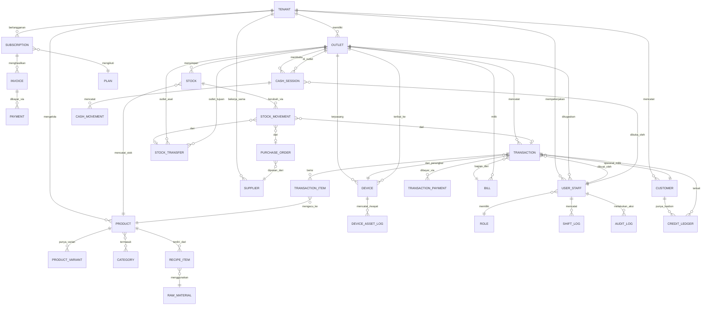

# ERD (Entity Relationship Diagram) — Sistem POS SaaS Multi-Tenant

## 1. Diagram Relasi Utama

---

## 2. Detail Entitas & Atribut Kunci

### TENANT (Merchant/Penyewa)
Entitas paling atas — merepresentasikan 1 akun merchant (bisa punya banyak outlet).

| Kolom | Tipe | Keterangan |
|---|---|---|
| tenant_id | UUID (PK) | Identitas unik tenant — **wajib jadi filter di semua tabel turunan** |
| business_name | string | Nama usaha (misal "Warung Makan Benjamin") |
| business_type | enum | fnb / kelontong / depot_air / laundry / campuran |
| owner_name | string | Nama pemilik |
| owner_phone | string | Kontak utama |
| status | enum | trial / aktif / suspend / nonaktif |
| created_at | datetime | |

### OUTLET
| Kolom | Tipe | Keterangan |
|---|---|---|
| outlet_id | UUID (PK) | |
| tenant_id | UUID (FK) | |
| outlet_name | string | |
| address | string | |
| active_modes | array/enum[] | Mode transaksi aktif: [langsung, open_bill, pesan_antar] |
| stock_model | enum | mandiri / terpusat |

### SUBSCRIPTION, PLAN, INVOICE, PAYMENT
Mengatur billing platform.

| Tabel | Kolom Kunci |
|---|---|
| PLAN | plan_id, nama_paket, limit_outlet, limit_user, harga_bulanan, fitur_json |
| SUBSCRIPTION | subscription_id, tenant_id, plan_id, device_bundle (boolean), tanggal_mulai, tanggal_berakhir, status |
| INVOICE | invoice_id, subscription_id, periode, jumlah_tagihan, status (belum_bayar/lunas/telat) |
| PAYMENT | payment_id, invoice_id, metode, jumlah, tanggal_bayar |

### DEVICE & DEVICE_ASSET_LOG (Manajemen Aset Perangkat)
| Kolom | Tipe | Keterangan |
|---|---|---|
| device_id | UUID (PK) | |
| tenant_id | UUID (FK) | |
| outlet_id | UUID (FK) | Perangkat terikat ke 1 outlet |
| device_type | enum | tablet / printer_thermal / edc |
| serial_number | string | Nomor seri/IMEI |
| ownership | enum | milik_platform (disewakan) / milik_merchant (BYOD) |
| status | enum | aktif / rusak_klaim / hilang / ditarik |
| deposit_amount | decimal | Hanya untuk ownership = milik_platform |
| last_known_location | geopoint (nullable) | Hanya diisi untuk device_type tablet/edc yang mendukung GPS. Dicatat sebagai lokasi TERAKHIR SAAT ONLINE, bukan real-time |
| last_seen_at | datetime | |
| DEVICE_ASSET_LOG | log_id, device_id, event_type (reset/klaim_rusak/hilang/lock_mdm), oleh_user_id, catatan, created_at |

### USER_STAFF & ROLE
| Kolom | Tipe | Keterangan |
|---|---|---|
| user_id | UUID (PK) | |
| tenant_id | UUID (FK) | |
| outlet_id | UUID (FK, nullable) | NULL untuk Owner (akses semua outlet); wajib diisi untuk Kasir/Dapur/Manager Outlet (dikunci ke 1 outlet) |
| role | enum | owner / regional_manager / manager_outlet / kasir / dapur |
| device_id_terikat | UUID (FK, nullable) | Untuk validasi login sesuai device binding |
| username / pin_hash | string | |

### PRODUCT, PRODUCT_VARIANT, CATEGORY
| Kolom | Tipe | Keterangan |
|---|---|---|
| product_id | UUID (PK) | |
| tenant_id | UUID (FK) | |
| nama_produk | string | |
| kategori_id | FK | |
| harga_default | decimal | |
| satuan | enum | pcs/kg/liter/dus/porsi |
| PRODUCT_VARIANT | variant_id, product_id, nama_varian (ukuran/rasa/dsb), harga_override |

### RECIPE_ITEM & RAW_MATERIAL (Bahan Baku, khusus FnB)
| Kolom | Tipe | Keterangan |
|---|---|---|
| recipe_item_id | PK | |
| product_id | FK | Menu jadi (misal "Nasi Goreng") |
| raw_material_id | FK | Bahan baku (misal "Beras") |
| jumlah_terpakai | decimal | Per 1 porsi terjual |

### STOCK & STOCK_MOVEMENT
| Kolom | Tipe | Keterangan |
|---|---|---|
| stock_id | PK | |
| outlet_id | FK | Stok dicatat **per outlet**, bukan digabung |
| product_id / raw_material_id | FK | |
| jumlah_saat_ini | decimal | |
| STOCK_MOVEMENT | movement_id, stock_id, tipe (masuk/keluar/opname/transfer), jumlah, referensi (purchase_order_id / transaction_id / stock_transfer_id), created_at |

### PURCHASE_ORDER & SUPPLIER
Pembelian barang dari pemasok.

### STOCK_TRANSFER
Perpindahan stok antar outlet (untuk model stok terpusat/gudang pusat).

### BILL & TRANSACTION
Pemisahan penting karena ada 3 mode transaksi:

| Kolom | Tipe | Keterangan |
|---|---|---|
| bill_id | PK | Representasi "1 tagihan berjalan" — dipakai untuk Mode B (open bill) & Mode C (pesan/titip) |
| outlet_id | FK | |
| mode | enum | langsung / open_bill / pesan_antar |
| status | enum | terbuka / diproses / siap_diambil / selesai_dibayar |
| label | string | Nomor meja / nama pelanggan / kode titipan |
| TRANSACTION | transaction_id, bill_id (nullable untuk Mode A), outlet_id, staff_id, device_id, subtotal, diskon, total, status |
| TRANSACTION_ITEM | item_id, transaction_id, product_id, qty, harga_satuan, catatan_modifier |
| TRANSACTION_PAYMENT | payment_id, transaction_id, metode (cash/qris/ewallet/edc), jumlah |

> Catatan: Mode A (langsung) bisa langsung buat TRANSACTION tanpa BILL. Mode B & C wajib lewat BILL dulu, baru ditutup jadi TRANSACTION saat bayar.

### CUSTOMER & CREDIT_LEDGER (Kasbon)
| Kolom | Tipe | Keterangan |
|---|---|---|
| customer_id | PK | |
| tenant_id | FK | |
| nama, no_hp | string | |
| CREDIT_LEDGER | ledger_id, customer_id, transaction_id, jumlah_utang, status (belum_lunas/lunas), tanggal_jatuh_tempo |

### CASH_SESSION & CASH_MOVEMENT
| Kolom | Tipe | Keterangan |
|---|---|---|
| session_id | PK | 1 sesi = 1 shift kasir (buka-tutup) |
| outlet_id, staff_id | FK | |
| modal_awal, kas_akhir_sistem, kas_akhir_fisik, selisih | decimal | |
| CASH_MOVEMENT | movement_id, session_id, tipe (penjualan/pengeluaran_petty_cash), jumlah, catatan |

### AUDIT_LOG
Log semua aksi sensitif lintas entitas: void transaksi, reset device, perubahan harga, dsb. Kolom: log_id, tenant_id, outlet_id, user_id, aksi, entitas_terkait, detail_json, created_at.

---

## 3. Prinsip Isolasi Data di Level Database

1. **Setiap tabel transaksional wajib punya `tenant_id`** — tidak ada satu pun tabel data merchant yang tidak punya kolom ini.
2. **Row-Level Security (RLS)** — kalau pakai PostgreSQL, aktifkan RLS policy per tabel: `USING (tenant_id = current_setting('app.current_tenant'))`, supaya proteksi tidak hanya bergantung pada kode aplikasi.
3. **Outlet-level filtering** untuk role Kasir/Manager Outlet — tambahan filter `outlet_id` di atas `tenant_id`, diterapkan di middleware auth berdasarkan `user_staff.outlet_id`, bukan dikirim dari client.
4. **Index wajib**: composite index `(tenant_id, outlet_id, created_at)` di tabel besar (TRANSACTION, STOCK_MOVEMENT) untuk performa query laporan.
5. **Soft-delete, bukan hard-delete** untuk data merchant yang berhenti langganan — flag `deleted_at`, baru dihapus permanen setelah masa retensi (misal 90 hari) oleh job terjadwal.
